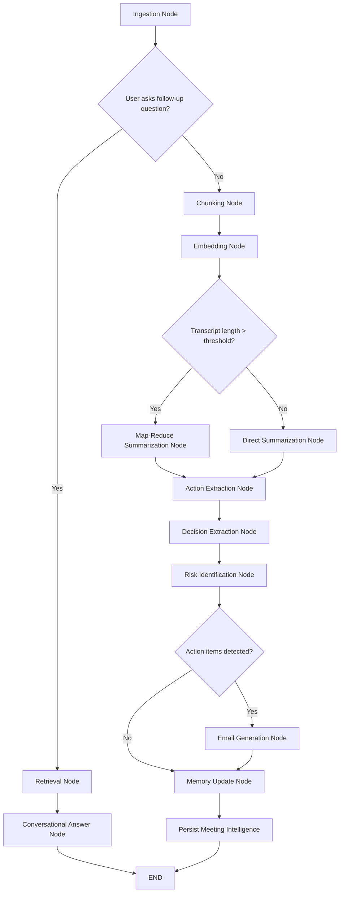
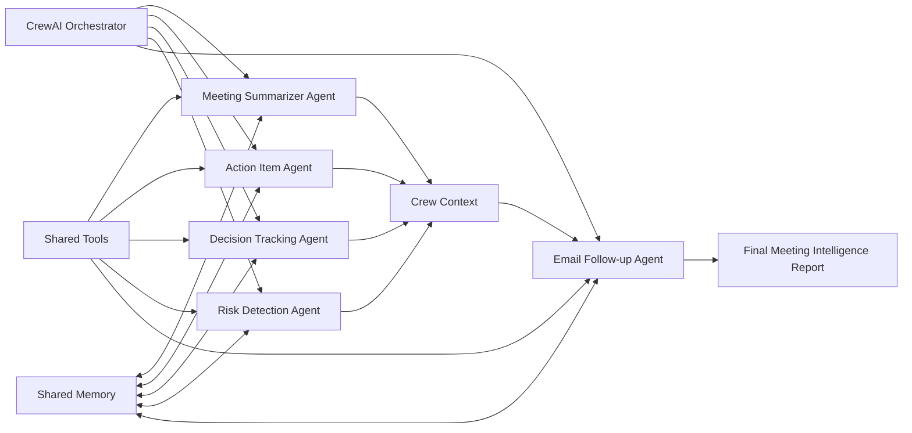
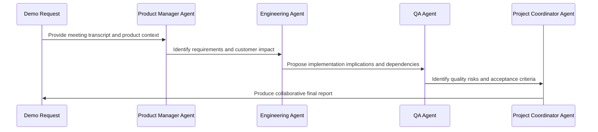

# Multi-Agent Meeting Intelligence Platform: Architecture Artifacts

Status: approved for architecture documentation only. Implementation of OpenAI, PostgreSQL, ChromaDB, Docker, and external service integrations must wait for the next approval.

## 1. Folder Structure

The project is designed as a Python monorepo with independently deployable service boundaries and a shared internal package.

```text
multi-agent-meeting-intelligence/
|-- .env.example
|-- .github/
|   `-- workflows/
|       `-- ci.yml
|-- alembic/
|   |-- env.py
|   `-- versions/
|-- docker/
|   |-- api-gateway.Dockerfile
|   |-- agent-service.Dockerfile
|   |-- ingestion-service.Dockerfile
|   |-- rag-service.Dockerfile
|   `-- summarization-service.Dockerfile
|-- docker-compose.yml
|-- docs/
|   |-- api.md
|   |-- architecture-artifacts.md
|   |-- deployment.md
|   |-- observability.md
|   `-- resume-positioning.md
|-- pyproject.toml
|-- README.md
|-- scripts/
|   |-- download_ami.py
|   |-- download_meetingbank.py
|   |-- ingest_datasets.py
|   `-- seed_local_data.py
|-- services/
|   |-- agent-service/
|   |   |-- main.py
|   |   `-- service_config.py
|   |-- api-gateway/
|   |   |-- main.py
|   |   `-- service_config.py
|   |-- ingestion-service/
|   |   |-- main.py
|   |   `-- service_config.py
|   |-- rag-service/
|   |   |-- main.py
|   |   `-- service_config.py
|   `-- summarization-service/
|       |-- main.py
|       `-- service_config.py
|-- src/
|   `-- meeting_intel/
|       |-- __init__.py
|       |-- agents/
|       |   |-- __init__.py
|       |   |-- autogen_layer.py
|       |   |-- crewai_layer.py
|       |   `-- prompts.py
|       |-- api/
|       |   |-- __init__.py
|       |   |-- app.py
|       |   |-- dependencies.py
|       |   |-- errors.py
|       |   |-- middleware.py
|       |   `-- routes.py
|       |-- core/
|       |   |-- __init__.py
|       |   |-- config.py
|       |   |-- constants.py
|       |   `-- security.py
|       |-- db/
|       |   |-- __init__.py
|       |   |-- models.py
|       |   |-- repository.py
|       |   `-- session.py
|       |-- ingestion/
|       |   |-- __init__.py
|       |   |-- dataset_loaders.py
|       |   |-- normalizer.py
|       |   `-- parsers.py
|       |-- observability/
|       |   |-- __init__.py
|       |   |-- logging.py
|       |   |-- metrics.py
|       |   `-- tracing.py
|       |-- rag/
|       |   |-- __init__.py
|       |   |-- chunking.py
|       |   |-- embeddings.py
|       |   |-- retriever.py
|       |   |-- reranker.py
|       |   `-- vector_store.py
|       |-- schemas/
|       |   |-- __init__.py
|       |   |-- api.py
|       |   |-- meeting.py
|       |   `-- persistence.py
|       |-- services/
|       |   |-- __init__.py
|       |   |-- email_service.py
|       |   |-- llm.py
|       |   `-- meeting_intelligence.py
|       |-- tools/
|       |   |-- __init__.py
|       |   |-- agent_tools.py
|       |   `-- openai_tool_registry.py
|       `-- workflows/
|           |-- __init__.py
|           |-- langgraph_workflow.py
|           `-- states.py
`-- tests/
    |-- integration/
    |   |-- test_api_contract.py
    |   |-- test_ingestion_pipeline.py
    |   `-- test_rag_pipeline.py
    `-- unit/
        |-- test_chunking.py
        |-- test_normalizer.py
        |-- test_parsers.py
        `-- test_schemas.py
```

## 2. Service Boundaries

### API Gateway

Responsibilities:

- Public FastAPI REST interface.
- Request validation with Pydantic.
- Request IDs, structured logging, error envelopes, and rate-limit hooks.
- Delegation to ingestion, RAG, summarization, and agent workflows.

### Ingestion Service

Responsibilities:

- Accept Zoom, Teams, Google Meet, TXT, PDF, DOCX, MeetingBank, and AMI sources.
- Parse source files.
- Clean transcripts.
- Normalize speaker turns.
- Produce the canonical meeting schema.

### RAG Service

Responsibilities:

- Chunk transcripts and meeting artifacts.
- Generate embeddings with `BAAI/bge-small-en-v1.5`.
- Store and retrieve vectors from the single ChromaDB collection `meeting_memory`.
- Apply metadata filtering, reranking, and context assembly.
- Manage conversation retrieval memory.

### Summarization Service

Responsibilities:

- Summarize meetings with `gpt-4o-mini`.
- Route short meetings to direct summarization.
- Route long meetings to map-reduce summarization.
- Extract summaries, decisions, risks, action items, and follow-ups in later phases.

### Agent Service

Responsibilities:

- Run CrewAI specialist task execution.
- Run LangGraph stateful orchestration.
- Run AutoGen collaborative reasoning demos.
- Expose agent execution traces and debugging outputs.

## 3. Agent Framework Responsibilities

The project intentionally uses three agent frameworks, but each framework has a specific boundary.

### CrewAI

CrewAI handles specialist task execution.

It is responsible for focused meeting-intelligence specialists:

- Meeting Summarization Agent
- Action Item Agent
- Decision Tracking Agent
- Risk Detection Agent
- Follow-up Email Agent

CrewAI agents own role-specific reasoning, tool use, memory, and handoff of outputs to the final meeting intelligence report.

### LangGraph

LangGraph handles orchestration and state management.

It is responsible for:

- Workflow state.
- Conditional routing.
- Long-transcript branching.
- Retrieval branching.
- Memory update sequencing.
- Agent execution graph visualization.

LangGraph is the core production workflow controller.

### AutoGen

AutoGen is optional and used only for collaborative reasoning demonstrations, not core business workflows.

It demonstrates agent-to-agent discussion between:

- Product Manager Agent
- Engineering Agent
- QA Agent
- Project Coordinator Agent

AutoGen should not be required for the main upload, summarize, ask, action-item, decision, risk, or email-draft API paths.

## 4. REST API Contract

Base URL: `/`

Common headers:

```http
Content-Type: application/json
X-Request-ID: optional-client-request-id
Authorization: Bearer <token>
```

### POST /upload

Creates a normalized meeting record from transcript text or meeting export content.

Request:

```json
{
  "title": "Sprint Planning - Payments Platform",
  "source_type": "zoom",
  "participants": ["Asha", "Rahul", "Mina"],
  "text": "Asha: We need to finish the reconciliation API..."
}
```

Response:

```json
{
  "meeting": {
    "meeting_id": "uuid",
    "title": "Sprint Planning - Payments Platform",
    "date": "2026-06-27T00:00:00Z",
    "participants": ["Asha", "Rahul", "Mina"],
    "transcript": [
      {
        "speaker": "Asha",
        "text": "We need to finish the reconciliation API...",
        "start_time": null,
        "end_time": null
      }
    ],
    "summary": "",
    "action_items": [],
    "decisions": [],
    "risks": [],
    "follow_ups": [],
    "embeddings_metadata": {
      "collection": "meeting_memory",
      "embedding_model": "BAAI/bge-small-en-v1.5",
      "chunk_count": 12
    }
  }
}
```

### POST /summarize

Runs meeting summarization.

Request:

```json
{
  "meeting_id": "uuid",
  "strategy": "auto"
}
```

Response:

```json
{
  "meeting_id": "uuid",
  "summary": {
    "executive_summary": "The team aligned on the release plan...",
    "topics": ["Payment reconciliation", "QA coverage", "Release risk"],
    "open_questions": ["Who owns vendor sandbox access?"]
  },
  "workflow": {
    "framework": "langgraph",
    "strategy": "direct|map_reduce",
    "trace_id": "trace-id"
  }
}
```

### POST /ask

Answers user questions using semantic retrieval and conversational memory.

Request:

```json
{
  "question": "What risks were discussed about the release?",
  "meeting_id": "uuid",
  "top_k": 5,
  "conversation_id": "uuid"
}
```

Response:

```json
{
  "answer": "The main release risks were vendor sandbox access and incomplete QA data...",
  "sources": [
    {
      "meeting_id": "uuid",
      "chunk_id": "uuid:transcript:0007",
      "score": 0.86,
      "text": "QA: We still do not have test data..."
    }
  ],
  "conversation_id": "uuid"
}
```

### POST /action-items

Extracts action items, owners, due dates, and priority.

Request:

```json
{
  "meeting_id": "uuid"
}
```

Response:

```json
{
  "meeting_id": "uuid",
  "action_items": [
    {
      "id": "uuid",
      "description": "Create reconciliation API test cases.",
      "owner": "Mina",
      "due_date": "2026-07-01",
      "priority": "high",
      "status": "open",
      "source_quote": "Mina will own QA coverage by Wednesday."
    }
  ]
}
```

### POST /decisions

Extracts decisions, rationale, owner, and supporting source quote.

Request:

```json
{
  "meeting_id": "uuid"
}
```

Response:

```json
{
  "meeting_id": "uuid",
  "decisions": [
    {
      "id": "uuid",
      "description": "Ship reconciliation API behind a feature flag.",
      "owner": "Rahul",
      "rationale": "Reduces rollout risk while allowing integration testing.",
      "source_quote": "Let's put this behind a feature flag for launch."
    }
  ]
}
```

### POST /risks

Identifies risks, severity, probability, mitigation, and owner.

Request:

```json
{
  "meeting_id": "uuid"
}
```

Response:

```json
{
  "meeting_id": "uuid",
  "risks": [
    {
      "id": "uuid",
      "description": "Vendor sandbox access may block QA.",
      "severity": "high",
      "probability": "medium",
      "mitigation": "Escalate sandbox credentials and create mock fallback.",
      "owner": "Asha"
    }
  ]
}
```

### POST /email-draft

Generates a follow-up email from summary, action items, decisions, and risks.

Request:

```json
{
  "meeting_id": "uuid",
  "audience": "meeting participants",
  "tone": "professional",
  "include_sections": ["summary", "actions", "decisions", "risks"]
}
```

Response:

```json
{
  "meeting_id": "uuid",
  "email": {
    "recipient": "meeting participants",
    "subject": "Follow-up: Sprint Planning - Payments Platform",
    "body": "Hi team,\n\nThanks for the discussion..."
  }
}
```

### GET /meetings/{id}

Returns the normalized meeting intelligence record.

Response:

```json
{
  "meeting": {
    "meeting_id": "uuid",
    "title": "Sprint Planning - Payments Platform",
    "date": "2026-06-27T00:00:00Z",
    "participants": ["Asha", "Rahul", "Mina"],
    "transcript": [],
    "summary": "The team aligned on...",
    "action_items": [],
    "decisions": [],
    "risks": [],
    "follow_ups": [],
    "embeddings_metadata": {}
  }
}
```

Error envelope:

```json
{
  "detail": "Human-readable error",
  "error_code": "MEETING_NOT_FOUND",
  "request_id": "uuid"
}
```

## 5. PostgreSQL Schema

PostgreSQL stores durable system-of-record data:

- meetings
- summaries
- action items
- decisions
- risks
- users
- embedding metadata
- conversation history

```sql
CREATE EXTENSION IF NOT EXISTS "uuid-ossp";

CREATE TABLE users (
    id UUID PRIMARY KEY DEFAULT uuid_generate_v4(),
    email VARCHAR(255) NOT NULL UNIQUE,
    name VARCHAR(255) NOT NULL,
    role VARCHAR(100) NOT NULL DEFAULT 'user',
    created_at TIMESTAMPTZ NOT NULL DEFAULT now(),
    updated_at TIMESTAMPTZ NOT NULL DEFAULT now()
);

CREATE TABLE meetings (
    id UUID PRIMARY KEY DEFAULT uuid_generate_v4(),
    title VARCHAR(500) NOT NULL,
    source_type VARCHAR(50) NOT NULL,
    source_uri TEXT,
    meeting_date TIMESTAMPTZ,
    participants JSONB NOT NULL DEFAULT '[]'::jsonb,
    transcript JSONB NOT NULL DEFAULT '[]'::jsonb,
    normalized_schema_version VARCHAR(50) NOT NULL DEFAULT 'v1',
    created_by UUID REFERENCES users(id),
    created_at TIMESTAMPTZ NOT NULL DEFAULT now(),
    updated_at TIMESTAMPTZ NOT NULL DEFAULT now()
);

CREATE TABLE summaries (
    id UUID PRIMARY KEY DEFAULT uuid_generate_v4(),
    meeting_id UUID NOT NULL REFERENCES meetings(id) ON DELETE CASCADE,
    executive_summary TEXT NOT NULL,
    topics JSONB NOT NULL DEFAULT '[]'::jsonb,
    open_questions JSONB NOT NULL DEFAULT '[]'::jsonb,
    model_name VARCHAR(100) NOT NULL DEFAULT 'gpt-4o-mini',
    trace_id VARCHAR(255),
    created_at TIMESTAMPTZ NOT NULL DEFAULT now()
);

CREATE TABLE action_items (
    id UUID PRIMARY KEY DEFAULT uuid_generate_v4(),
    meeting_id UUID NOT NULL REFERENCES meetings(id) ON DELETE CASCADE,
    description TEXT NOT NULL,
    owner VARCHAR(255),
    due_date DATE,
    priority VARCHAR(50) NOT NULL DEFAULT 'medium',
    status VARCHAR(50) NOT NULL DEFAULT 'open',
    source_quote TEXT,
    created_at TIMESTAMPTZ NOT NULL DEFAULT now(),
    updated_at TIMESTAMPTZ NOT NULL DEFAULT now()
);

CREATE TABLE decisions (
    id UUID PRIMARY KEY DEFAULT uuid_generate_v4(),
    meeting_id UUID NOT NULL REFERENCES meetings(id) ON DELETE CASCADE,
    description TEXT NOT NULL,
    owner VARCHAR(255),
    rationale TEXT,
    source_quote TEXT,
    created_at TIMESTAMPTZ NOT NULL DEFAULT now()
);

CREATE TABLE risks (
    id UUID PRIMARY KEY DEFAULT uuid_generate_v4(),
    meeting_id UUID NOT NULL REFERENCES meetings(id) ON DELETE CASCADE,
    description TEXT NOT NULL,
    severity VARCHAR(50) NOT NULL DEFAULT 'medium',
    probability VARCHAR(50) NOT NULL DEFAULT 'medium',
    mitigation TEXT,
    owner VARCHAR(255),
    status VARCHAR(50) NOT NULL DEFAULT 'open',
    created_at TIMESTAMPTZ NOT NULL DEFAULT now(),
    updated_at TIMESTAMPTZ NOT NULL DEFAULT now()
);

CREATE TABLE follow_ups (
    id UUID PRIMARY KEY DEFAULT uuid_generate_v4(),
    meeting_id UUID NOT NULL REFERENCES meetings(id) ON DELETE CASCADE,
    recipient TEXT,
    subject TEXT NOT NULL,
    body TEXT NOT NULL,
    tone VARCHAR(50) NOT NULL DEFAULT 'professional',
    created_at TIMESTAMPTZ NOT NULL DEFAULT now()
);

CREATE TABLE embedding_metadata (
    id UUID PRIMARY KEY DEFAULT uuid_generate_v4(),
    meeting_id UUID NOT NULL REFERENCES meetings(id) ON DELETE CASCADE,
    chunk_id VARCHAR(255) NOT NULL UNIQUE,
    collection_name VARCHAR(255) NOT NULL DEFAULT 'meeting_memory',
    embedding_model VARCHAR(255) NOT NULL DEFAULT 'BAAI/bge-small-en-v1.5',
    artifact_type VARCHAR(50) NOT NULL,
    chunk_index INTEGER NOT NULL,
    token_count INTEGER,
    source_type VARCHAR(50),
    metadata JSONB NOT NULL DEFAULT '{}'::jsonb,
    created_at TIMESTAMPTZ NOT NULL DEFAULT now()
);

CREATE TABLE conversation_history (
    id UUID PRIMARY KEY DEFAULT uuid_generate_v4(),
    meeting_id UUID REFERENCES meetings(id) ON DELETE SET NULL,
    user_id UUID REFERENCES users(id) ON DELETE SET NULL,
    conversation_id UUID NOT NULL,
    role VARCHAR(50) NOT NULL,
    content TEXT NOT NULL,
    retrieved_chunk_ids JSONB NOT NULL DEFAULT '[]'::jsonb,
    trace_id VARCHAR(255),
    created_at TIMESTAMPTZ NOT NULL DEFAULT now()
);

CREATE INDEX idx_meetings_created_at ON meetings(created_at DESC);
CREATE INDEX idx_meetings_source_type ON meetings(source_type);
CREATE INDEX idx_action_items_meeting_id ON action_items(meeting_id);
CREATE INDEX idx_decisions_meeting_id ON decisions(meeting_id);
CREATE INDEX idx_risks_meeting_id ON risks(meeting_id);
CREATE INDEX idx_embedding_metadata_meeting_id ON embedding_metadata(meeting_id);
CREATE INDEX idx_embedding_metadata_artifact_type ON embedding_metadata(artifact_type);
CREATE INDEX idx_conversation_history_conversation_id ON conversation_history(conversation_id);
```

## 6. ChromaDB Collection Schema

Use a single ChromaDB collection:

```text
meeting_memory
```

Use metadata filtering instead of multiple collections.

Embedding model:

```text
BAAI/bge-small-en-v1.5
```

Distance metric:

```text
cosine
```

Document ID format:

```text
{meeting_id}:{artifact_type}:{chunk_index}
```

Examples:

```text
8c6f...:transcript:0007
8c6f...:summary:0000
8c6f...:action_item:0002
8c6f...:decision:0001
8c6f...:risk:0003
```

Supported artifact types:

- `transcript`
- `summary`
- `action_item`
- `decision`
- `risk`
- `follow_up`

Metadata schema:

```json
{
  "meeting_id": "uuid",
  "title": "Sprint Planning - Payments Platform",
  "artifact_type": "transcript",
  "source_type": "zoom",
  "chunk_index": 7,
  "speaker_names": ["Asha", "Rahul"],
  "participant_names": ["Asha", "Rahul", "Mina"],
  "meeting_date": "2026-06-27T00:00:00Z",
  "token_count": 286,
  "char_start": 8400,
  "char_end": 9600,
  "postgres_embedding_metadata_id": "uuid",
  "created_at": "2026-06-27T00:00:00Z",
  "schema_version": "v1"
}
```

## 7. Retrieval And Reranking Strategy

The RAG pipeline follows a four-step retrieval strategy.

### Step 1: Initial Vector Retrieval

- Embed the user query with `BAAI/bge-small-en-v1.5`.
- Retrieve a broad candidate set from `meeting_memory`.
- Default candidate count: top 20.
- For meeting-specific questions, include `meeting_id` as a metadata filter.

### Step 2: Metadata Filtering

Apply metadata filters before context assembly:

```json
{
  "meeting_id": "uuid",
  "artifact_type": "transcript",
  "source_type": "zoom"
}
```

Supported filters:

- meeting ID
- source type
- artifact type
- participant or speaker
- meeting date range

### Step 3: Reranking

Rerank retrieved candidates using:

1. Vector similarity score.
2. Lexical overlap with the question.
3. Artifact priority.
4. Recency where relevant.

Initial MVP reranker:

```text
weighted_score =
  0.65 * vector_similarity +
  0.20 * lexical_overlap +
  0.10 * artifact_priority +
  0.05 * recency_score
```

Future enhancement:

- Cross-encoder reranker.
- LLM-based answerability scoring.
- Diversity-aware retrieval to reduce duplicate chunks.

### Step 4: Context Assembly

- Select final top 5 chunks by reranked score.
- Deduplicate near-identical chunks.
- Preserve source metadata.
- Assemble context in chronological order when chunks come from the same meeting.
- Pass context to `gpt-4o-mini`.
- Persist retrieved chunk IDs in `conversation_history`.

## 8. Transcript Size Thresholds

The summarization strategy is selected by transcript size.

```text
Short meeting:
  <= 16,000 characters or approximately <= 4,000 tokens
  Strategy: direct summarization

Long meeting:
  > 16,000 characters or approximately > 4,000 tokens
  Strategy: map-reduce summarization
```

Direct summarization:

- One prompt.
- Lower latency.
- Used for short standups, quick syncs, and compact meeting exports.

Map-reduce summarization:

- Split transcript into chunks.
- Summarize each chunk independently.
- Combine chunk summaries into final executive summary.
- Used for long Zoom, Teams, Google Meet, MeetingBank, and AMI transcripts.

## 9. LangGraph Execution Graph



LangGraph state:

```json
{
  "meeting": "MeetingDocument",
  "question": "optional string",
  "chunks": [],
  "retrieval_hits": [],
  "summary": {},
  "action_items": [],
  "decisions": [],
  "risks": [],
  "follow_ups": [],
  "trace_id": "string",
  "route": "string"
}
```

Conditional routing:

```python
if state.question:
    route = "retrieval"
elif len(state.meeting.transcript_text) > MAX_TRANSCRIPT_CHARS:
    route = "map_reduce_summarization"
else:
    route = "direct_summarization"

if state.action_items:
    route = "email_generation"
else:
    route = "memory_update"
```

## 10. CrewAI Interaction Flow

CrewAI handles specialist task execution.



Agents:

| Agent | Role | Goal | Tools | Memory |
|---|---|---|---|---|
| Meeting Summarizer Agent | Executive meeting analyst | Produce concise summaries, topics, and open questions | transcript retrieval, semantic search | enabled |
| Action Item Agent | Delivery manager | Extract owner, due date, priority, dependencies | calendar lookup, meeting search | enabled |
| Decision Tracking Agent | Governance analyst | Capture decisions, rationale, source quotes | transcript retrieval, semantic search | enabled |
| Risk Detection Agent | Enterprise risk analyst | Identify delivery, quality, compliance, and stakeholder risks | meeting search, semantic search | enabled |
| Email Follow-up Agent | Executive communications partner | Draft follow-up emails from crew outputs | email drafting, calendar lookup | enabled |

Baseline execution:

```text
Summarizer -> Action Item Agent -> Decision Tracking Agent -> Risk Detection Agent -> Email Follow-up Agent
```

Future enhancement:

```text
Summarizer first, action/decision/risk agents in parallel, email agent synthesizes final output.
```

## 11. AutoGen Interaction Flow

AutoGen is optional and used only for collaborative reasoning demonstrations.

It is not part of the critical production path for summarization, retrieval, action-item extraction, decision extraction, risk detection, or email drafting.



Demo responsibilities:

- Product Manager Agent: extracts requirements, business value, and customer impact.
- Engineering Agent: evaluates feasibility, implementation approach, and dependencies.
- QA Agent: identifies test strategy, release risks, and acceptance gaps.
- Project Coordinator Agent: synthesizes final recommendations, owners, and next steps.

## 12. Deployment Architecture

Initial local deployment:

```text
Developer Machine
|-- FastAPI app
|-- Local/offline mock LLM mode
|-- Local/offline mock embedding mode
`-- Optional local ChromaDB and PostgreSQL in later phases
```

Production-oriented Docker Compose deployment:

```text
docker-compose
|-- api-gateway
|-- ingestion-service
|-- summarization-service
|-- rag-service
|-- agent-service
|-- postgres
`-- chromadb
```

Future cloud deployment options:

- AWS ECS or EKS.
- Azure Container Apps or AKS.
- GCP Cloud Run or GKE.
- Render, Railway, or Fly.io for startup-style portfolio deployment.

## 13. Offline Development Mode

Offline mode is required so development and CI can run without external API dependencies.

Offline mode capabilities:

- Mock LLM responses.
- Mock embeddings.
- Disable OpenAI calls.
- Disable ChromaDB dependency in unit tests.
- Disable PostgreSQL dependency in unit tests.
- Use in-memory repositories for API contract tests.
- Use deterministic fixtures for summarization, action items, decisions, and risks.

Environment flag:

```text
OFFLINE_MODE=true
```

Expected behavior:

- API tests run without OpenAI API keys.
- Unit tests do not download `BAAI/bge-small-en-v1.5`.
- RAG tests can use deterministic mock vectors.
- CI can validate code quality and API behavior without paid services.

## 14. Cost Controls

The platform should include cost controls from the first production-oriented implementation.

### Embedding Cache

- Cache embeddings by content hash.
- Avoid re-embedding unchanged transcript chunks.
- Store cache metadata in PostgreSQL and optionally local disk for development.

### Prompt Cache

- Cache deterministic LLM outputs by prompt hash, model name, and input artifact hash.
- Use cache for repeated summarization and extraction jobs.
- Support cache invalidation when prompts or model versions change.

### Token Accounting

Track:

- prompt tokens
- completion tokens
- embedding input tokens
- total estimated cost
- meeting-level cost
- request-level cost
- user-level cost

### Request Limits

Support configurable limits:

- max transcript size per upload
- max questions per minute
- max summarization requests per user
- max daily LLM spend
- max retrieval context tokens
- max map-reduce chunk count

## 15. MVP Implementation Order

### Phase 1

Goal: working demo quickly.

- FastAPI
- MeetingBank ingestion
- ChromaDB
- GPT-4o-mini summarization

### Phase 2

Goal: structured meeting intelligence and persistence.

- Action item extraction
- AMI ingestion
- PostgreSQL persistence

### Phase 3

Goal: agentic orchestration.

- CrewAI agents
- LangGraph orchestration

### Phase 4

Goal: production polish and portfolio completeness.

- AutoGen
- Docker
- LangSmith
- GitHub Actions

## 16. Missing Risks And Bottlenecks

Risks to manage:

- Framework overlap: CrewAI, LangGraph, and AutoGen must keep strict boundaries.
- Local embedding model latency: `BAAI/bge-small-en-v1.5` may slow first startup.
- ChromaDB and PostgreSQL consistency: vector writes and metadata writes need recovery logic.
- Long transcript cost: map-reduce summarization can increase token usage quickly.
- Dataset ingestion complexity: MeetingBank and AMI formats may require separate normalizers.
- PDF and DOCX parsing quality: speaker boundaries may be unreliable.
- AutoGen nondeterminism: demos need max rounds, strict prompts, and fallback summaries.
- Reranking quality: MVP weighted reranking is useful but not equivalent to a trained reranker.
- Observability gaps: agent-level and node-level traces must be implemented deliberately.
- Security: uploaded meeting content may contain sensitive enterprise information.
- Evaluation: summarization and extraction quality need fixture-based and human-reviewed benchmarks.

## 17. Approval Gate

Do not proceed to implementation until approval is given for this architecture artifact.

Approval should cover:

1. Folder tree and service boundaries.
2. Framework responsibilities.
3. API contract shape.
4. PostgreSQL schema.
5. Single ChromaDB collection design.
6. Retrieval and reranking strategy.
7. Transcript threshold strategy.
8. Offline development mode.
9. Cost controls.
10. MVP phase order.
